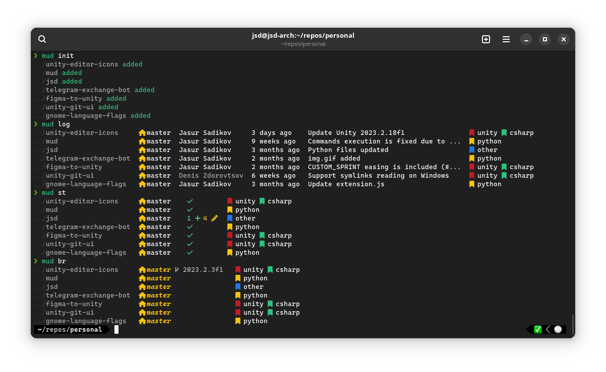

# mud


[](https://github.com/jasursadikov/mud/actions/workflows/test.yaml)
[](https://github.com/jasursadikov/mud/actions/workflows/publish-pypi.yaml)
[](https://github.com/jasursadikov/mud/actions/workflows/publish-aur.yaml)



mud is CLI utility that allows you to run git commands in multiple repositories. It has multiple powerful filtering tools, native commands with an informative terminal output and support of aliasing. This tool is not limited to git commands only; you can run any commands you wish. However, this tool was primarily designed to be used with git, so each referenced directory should have a `.git` directory.

## Installing
**PyPI**
```bash
pip install mud-git
```
**ArchLinux**
```bash
yay -S mud-git
```

For requirements check [requirements.txt](requirements.txt).

## Getting started

1. Run `mud config` to start an interactive wizard that helps you set the preferred settings. Check the [settings](#settings) section for more details. At the end, a `.mudsettings` file will appear in your home directory, which you can modify in the future.
2. Navigate to your preferred directory with repositories.
3. Run the `mud init` command to create a `.mudconfig` file. This file is important for keeping references to repositories. All repositories in the current directory will be included in `.mudconfig`.
4. Optional: Run [`mud set-global`](#commands) to make the current configuration default and accessible from any directory.

All entries are stored in `.mudconfig` in TSV format. After making your first entry, you can open `.mudconfig` in a text editor and modify it according to your needs.

Now you're able to run any command. Some examples:
```bash
# Fetch all repositories
mud git fetch
# Switching all repositories to a "master" branch
mud git checkout master
# Alternatively, you can filter only repos on non-master branch and switch them to master
mud --not-branch=master git checkout master
# Pull all diverged branches
mud --diverged git pull
```

## Using

### Commands
| Command                         | Description                                                                                                                       |
|---------------------------------|-----------------------------------------------------------------------------------------------------------------------------------|
| `mud init`                     | creates `.mudconfig` and adds repositories beneath the current directory. |
| `mud configure`/`mud config`    | runs the interactive settings wizard, saving only to `~/.config/mud/settings.ini`. If the modern file is missing, normal startup moves `~/.mudsettings` there or creates defaults if neither exists. An existing modern file takes precedence and leaves the legacy file untouched; mud never creates `~/.mudsettings`. |
| `mud help`/`mud --help`/`mud -h` | displays available commands and flags. |
| `mud set-global [path]`         | sets the current `.mudconfig`, or the specified configuration path, as the fallback configuration to run from any directory; saves to `~/.config/mud/settings.ini`. |
| `mud get-config`                | prints the current `.mudconfig` location.                                                                                         |
| `mud prune`                     | removes all invalid repositories from the `.mudconfig`.                                                                           |
| `mud info`/`mud i`              | displays branch divergence and working directory changes.                                                                         |
| `mud status`/`mud st`           | displays working directory changes.                                                                                               |
| `mud log`/`mud l`               | displays the latest commit message, its time, and its author.                                                                     |
| `mud labels`/`mud lb`           | displays mud labels across repositories.                                                                                          |
| `mud branch`/`mud branches`/`mud br` | displays all branches in repositories.                                                                                        |
| `mud remote-branch`/`mud remote-branches`/`mud rbr` | displays all remote branches in repositories.                                                               |
| `mud complete-branch`           | prints unique current branch names across repositories for shell completion.                                                      |
| `mud complete-branch-all`       | prints unique local and remote branch names across repositories for shell completion.                                             |
| `mud completion carapace`       | exports a Carapace spec for all commands, aliases, flags, and native arguments; dynamically completes labels, local/remote branch names, and configured repository paths. |
| `mud completion values`         | internal read-only Carapace callback; reads completion context from `C_ARG<n>` and `C_VALUE`, never executing command text. |
| `mud tags`/`mud tag`/`mud t`     | displays git tags in repositories.                                                                                                |

`--` format is also supported. An example would be `mud -- git status`.

### Flags

`mud <FLAG> <COMMAND>` will execute a bash command across all repositories.

| Flag                                     | Description                                                                          |
|------------------------------------------|--------------------------------------------------------------------------------------|
| `-n=<str>` or `--name=<str>`             | includes repositories that contains provided string.                                 |
| `-N=<str>` or `--not-name=<str>`         | excludes repositories whose path contains the provided string; repeat to exclude multiple substrings. |
| `-l=<label>` or `--label=<label>`        | includes repositories with the provided label.                                       |
| `-L=<label>` or `--not-label=<label>`    | excludes repositories with the provided label.                                       |
| `-b=<branch>` or `--branch=<branch>`     | includes repositories with the provided branch.                                      |
| `-B=<branch>` or `--not-branch=<branch>` | excludes repositories with the provided branch.                                      |
| `-c="<command>"` or `--command="<command>"` | explicit shell command; no completion inside its value, but mud filters remain available in following arguments. |
| `--`                                    | starts an opaque shell command; no mud completion or filtering after this separator. |
| `-m` or `--modified`                     | filters out modified repositories.                                                   |
| `-d` or `--diverged`                     | filters repositories with diverged branches.                                         |
| `-t` or `--table`                        | toggles the default table view setting for execution.                                |
| `-a` or `--async`                        | toggles the asynchronous execution feature.                                          |

Example:

```bash
# Filters out all repos with the master branch and diverged branches and then runs the pull command.
mud -b=master -d git pull

# Fetches all repositories that are not on the master branch and have the "personal" label, excluding those with the "work" label.
mud -B=master -l=personal -L=work git fetch
```

Completion helpers:

```bash
# Menu for -b= and -B= suggestions
mud complete-branch

# Full unique branch menu suitable for commands like "mud to <branch>"
mud complete-branch-all
```

| Carapace Setup | Instructions |
|----------------|--------------|
| Requirements | Install `mud` and [Carapace](https://carapace-sh.github.io/carapace-bin/install.html) on `PATH`; the same spec works across Carapace-supported shells. |
| Install Spec (Nushell, Linux) | `let specs = (($env.XDG_CONFIG_HOME? \| default ($nu.home-path \| path join .config)) \| path join carapace specs)`; `mkdir $specs`; `mud completion carapace \| save --force ($specs \| path join mud.yaml)` |
| Install Spec (Bash/Zsh, Linux) | `mkdir -p "${XDG_CONFIG_HOME:-$HOME/.config}/carapace/specs"`; `mud completion carapace > "${XDG_CONFIG_HOME:-$HOME/.config}/carapace/specs/mud.yaml"` |
| Nushell Hook | Follow [Carapace's Nushell setup](https://carapace-sh.github.io/carapace-bin/setup.html#nushell), or use `{\|spans\| carapace $spans.0 nushell ...$spans \| from json }` as your external completer; preserve empty results for mud rather than falling back to file or command completion. |
| Bash/Zsh Hook | `source <(carapace _carapace)`; Zsh also requires `autoload -U compinit && compinit`. |
| Fish Hook | `carapace _carapace fish \| source` |
| Other Platforms/Shells | Install `mud.yaml` in [Carapace's user spec directory](https://carapace-sh.github.io/carapace-bin/spec/user.html), then follow the appropriate [shell setup](https://carapace-sh.github.io/carapace-bin/setup.html). Restart the shell after first installing the spec. |
| Dynamic Values | Labels and paths come from the nearest ancestor `.mudconfig` or global fallback; branches include unique local and remote names with remote prefixes removed. Branch filters still match the current branch. No settings or repositories are written during completion. |
| Command Boundaries | Complete mud filters before a command or `--`, or after a completed `-c="..."` argument. Arbitrary shell commands and alias arguments are not completed. |

## Settings

Settings are stored at `~/.config/mud/settings.ini`.

| Key                      | Value                    | Description                                                                      |
|--------------------------|--------------------------|----------------------------------------------------------------------------------|
| `run_async`              | `True`/`False`           | enables asynchronous commands.                                                   |
| `run_table`              | `True`/`False`           | enables table view for asynchronous commands. Requires `run_async`.              |
| `nerd_fonts`             | `True`/`False`           | enables nerd fonts in the output.                                                |
| `display_borders`        | `True`/`False`           | enables borders in the table view.                                               |
| `display_headers`        | `True`/`False`           | enables headers in the table view.                                               |
| `display_absolute_paths` | `True`/`False`           | displays absolute paths for directories.                                         |
| `round_corners`          | `True`/`False`           | enables round corners for the table view. Requires `show_borders` to be enabled. |
| `collapse_paths`         | `True`/`False`           | simplifies branch names in the branch view.                                      |
| `config_path`            | `~/Documents/.mudconfig` | this is set by the `mud set-global` command.                                     |

### Aliases

You can create your own aliases. To do so, edit the `[alias]` section of the `.mudsettings` file. The `.mudsettings` file has the following aliases by default:
```ini
[alias]
to = git checkout
fetch = git fetch
pull = git pull
push = git push
```

## Labeling

You can modify your `.mudconfig` file using the following commands:

| Command                     | Description                                    |
|-----------------------------|------------------------------------------------|
| `mud add <path>`/`mud a <path>` | adds a path without a label.                |
| `mud add <path> <label>`/`mud a <path> <label>` | adds a path with an optional label. |
| `mud remove <path>`/`mud rm <path>` | removes the directory with the specified path. |
| `mud remove <path> <label>`/`mud rm <path> <label>` | removes the label from a directory. |
