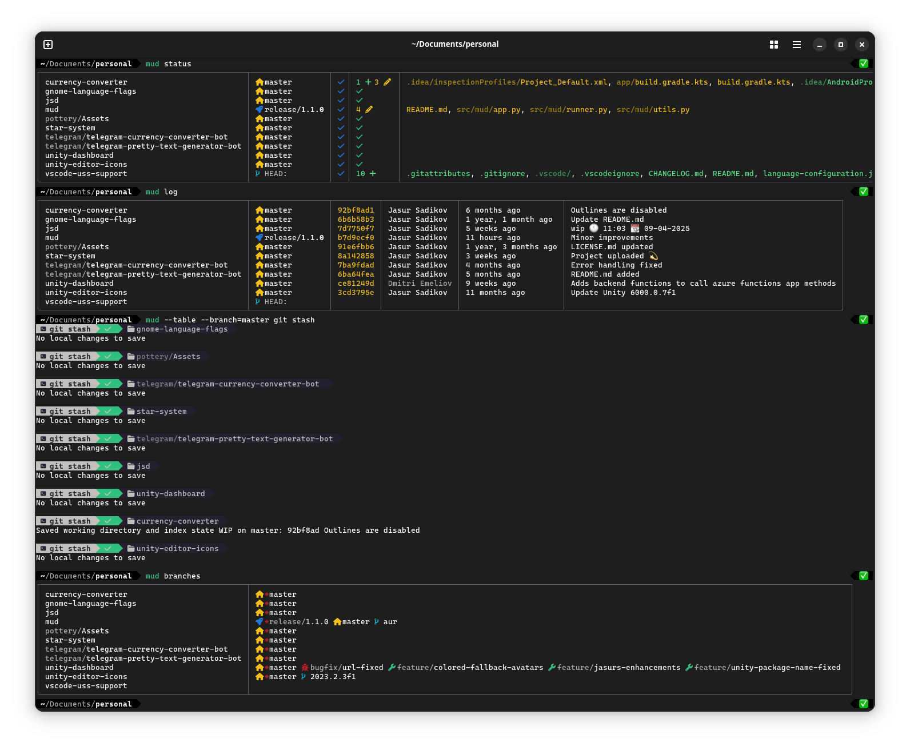

# mud



mud is a multidirectory git runner. Using this tool you can run git commands in a groups of repositories. This tool is not limited to git commands only, you can run any commands as you wish, but this tool was primarally designed to be used with git, so each referenced directory should have `.git`.

## Installing

There is no an installation guide for this tool, but if you're using Linux like I do, I would suggest to download this repo somewhere and create a symlink to the `mud.py` file in `~/bin` directory in order to run this script.
You can copy following bash script and run it.
```bash
git clone https://github.com/jasursadikov/mud
cd mud
ln -s $PWD/mud.py ~/.local/bin/mud
chmod +x ~/.local/bin/mud
py -m venv venv
source venv/bin/activate
pip install prettytable
```

## Getting started

1. Run `mud configure`/`mud config` to run interactive wizard which will ask you to set the preferable settings. Check section [Settings](#settings) for more. This will create `.mudsettings` file in your home directory that you can alter in future.
2. Locate to your preferable directroy with multiple repositories.
3. Run `mud init` command to create `.mudconfig` file. This file is important to keep references to repositories. All repositories in current dictionary would be included to `.mudconfig`.
4. Run [`mud --set-global`](#global-mudconfig) to make current configuration default and reachable from any directory.

All entries are stored in `.mudconfig` in XML format. After making your first entry, you can open `.mudconfig` in a text editor and modify it according to your needs.

### Global .mudconfig
- `mud --set-global` - sets current `.mudconfig` as a global configuration, so it would be used as a fallback configuration to run from any directory.

## Using

### Commands
`mud <COMMAND>` will run command on all repositories. To filter repositories check [filtering](#filters) section.

- `mud labels` - displays labels for all repositores.
- `mud log` - displays log with information about repo's last commit, it's time and it's author.
- `mud status` - displays status in a compact table for multiple repositories.
- `mud branch` - displays all branches in repositories.
- `mud tags` - displays git tags for all repositores.

### Filters
mud has following filters:
- `-l=<label>` or `--label=<label>` - filters out repositories by mud labels.
- `-b=<branch>` or `--branch=<branch>` - filters out repositories by current branch name.
- `-m` or `--modified` - filters out modified repostories.
- `-d` or `--diverged` - filters repositories with diverged branches.

All filters should be applied before the command. 

```
Example:
mud -b=master -d git pull
# Filters out all repos with master branch and diverged branches and then runs pull command.
```

## Settings

Settings are stored in your home directory in `.mudsettings` file.

- `config_path = /home/user/path/.mudconfig` - this is set up by `mud --set-global` [command](#global-mudconfig).
- `nerd_fonts = 0/1` - toggles whenever nerd font icons should be used in output.
- `auto_fetch = 0/1` - when enabled, `mud status` and `mud log` do fetch for all repos when invoked.
- `run_async = 0/1` - enabled to run commands asyncronously.
- `run_table = 0/1` - enable to see asyncronous commands in a table view. Requires `run_async`.
- `simplify_branches = 0/1` - simplifies branch name in the branch view.

### Aliases
You can create your own aliases for commands. To create your own aliases, edit .mudsettings file, `[alias]` section. .mudsettings has following aliases by default:
```ini
[alias]
to = git checkout
fetch = git fetch
pull = git pull
push = git push
```

## Labeling

You can modify your .mudconfig file by using following commands:

### Adding and labeling repositories
- `mud add <label> <path>` - adds path with an optional label.
- `mud add <path>` - adds path without a label.

### Removing labels and repositories
- `mud remove <label>` - removes label from all directories.
- `mud remove <path>` - removes directory with a specified path.
- `mud remove <label> <path>` - removes label from a directory.
